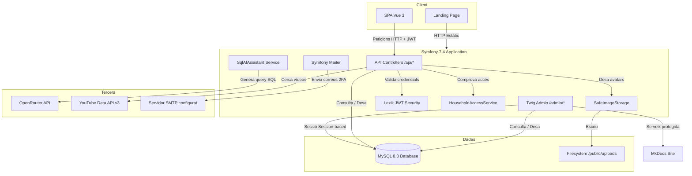
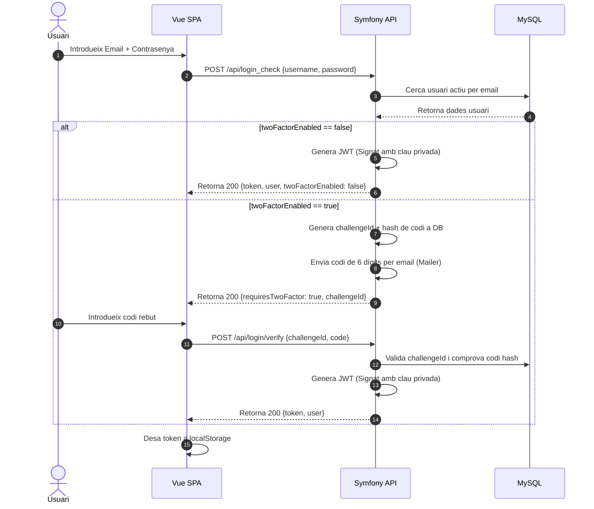

# Arquitectura general

HomeTab es basa en una arquitectura fullstack desacoblada, on el backend és una API REST *stateless* acompanyada d'un panell d'administració monolític, i el frontend és una Single Page Application (SPA).

---

## 1. Topologia del sistema

El sistema s'estructura en tres capes clarament diferenciades:

```
┌────────────────────────────────────────────────────────┐
│                   Capa de Client                       │
│  ┌──────────────────┐           ┌──────────────────┐   │
│  │   SPA Vue 3      │           │  Landing Pública │   │
│  │  (Port 5173)     │           │   (HTML/JS)      │   │
│  └────────┬─────────┘           └─────────┬────────┘   │
└───────────┼───────────────────────────────┼────────────┘
            │                               │
            │ HTTP (JSON + JWT)             │ HTTP
            ▼                               ▼
┌───────────┼───────────────────────────────┼────────────┐
│           │        Capa d'Aplicació       │            │
│  ┌────────┴─────────┐           ┌────────┴─────────┐   │
│  │    API Symfony   │           │ Backoffice Twig  │   │
│  │   (Stateless)    │           │    (Stateful)    │   │
│  └────────┬─────────┘           └────────┬─────────┘   │
└───────────┼──────────────────────────────┼─────────────┘
            │                              │
            │ Doctrine ORM                 │ SQL / Doctrine
            ▼                              ▼
┌───────────┼──────────────────────────────┼────────────┐
│           │       Capa de Dades          │            │
│  ┌────────┴─────────┐           ┌────────┴─────────┐   │
│  │    Base Dades    │◄──────────┤   Assistent IA   │   │
│  │   MySQL 8.0      │           │ (SqlAIAssistant) │   │
│  └──────────────────┘           └──────────────────┘   │
└────────────────────────────────────────────────────────┘
```

---

## 2. Diagrama de context (Mermaid)

El següent diagrama visualitza el context d'interacció de l'aplicació i les seves integracions amb tercers:



---

## 3. Fluxos de seguretat detallats

### Autenticació JWT (Stateless API)
L'SPA Vue consumeix l'API de forma totalment desacoblada usant JWT (JSON Web Tokens) signats amb algorisme RSA (clau privada/pública):



A partir d'aquest punt, totes les peticions a l'API inclouen la capçalera `Authorization: Bearer <token>`. El backend valida el token amb la clau pública RSA de forma completament *stateless*.

### Autenticació Backoffice (Stateful Web)
El panell d'administració utilitza l'arquitectura de seguretat estàndard de Symfony basada en cookies de sessió.

1. El superadmin accedeix a `/login`.
2. S'autentica via `LoginFormAuthenticator`.
3. Es crea una cookie de sessió identificadora.
4. El firewall `main` protegeix totes les rutes `/admin/*`, que requereixen el rol `ROLE_SUPER_ADMIN`.

---

## 4. Decisions de Disseny Arquitectònic

### Separació estricta de Firewall
Es configuren dos firewalls principals a `security.yaml` per evitar col·lisions d'autenticació:
*   **Firewall `api`**: Patró `^/api`, `stateless: true`, fa servir `jwt` de Lexik.
*   **Firewall `main`**: Patró `^/`, `lazy: true`, basat en form de login i sessions PHP tradicionals.

### Servei de Documentació MkDocs Protegit
Per tal d'evitar l'exposició pública dels diagrames tècnics i les estructures de base de dades:
1.  MkDocs es compila al directori `docs/mkdocs/site`, que està **fora** de la carpeta pública de servei d'estàtics (`public/`).
2.  El controlador `AdminDocumentationController` actua com a proxy: intercepta les peticions a `/admin/documentacio/{path}`, comprova que l'usuari disposi del rol `ROLE_SUPER_ADMIN` i serveix el fitxer corresponent. Així es garanteix l'aïllament absolut de la documentació.

### Borrat Lògic (Soft Delete)
Les entitats `Task`, `Expense` i `Event` inclouen la propietat `isActive`. Un `DELETE` des de la interfície no executa un `DELETE` a la base de dades, sinó un canvi d'estat a `false`. Això manté la integritat referencial de l'historial (com ara les despeses compartides del mes anterior o els logs de xat).
