# Model de dades

El model de dades de HomeTab s'estructura sota una base de dades relacional **MySQL 8.0**. Doctrine ORM gestiona el mapatge de les classes PHP a les taules de la base de dades.

---

## 1. Diagrama Entitat-Relació complet (Mermaid ER)

El següent diagrama mostra les 14 entitats del sistema i com es relacionen entre elles:

```mermaid
erDiagram
    USER {
        int id PK
        string email UK
        string password
        json roles
        string first_name
        string last_name
        string phone_number
        text bio
        string avatar
        string avatar_icon
        boolean is_active
        datetime joined_at
        datetime disabled_at
        boolean two_factor_enabled
        datetime two_factor_enabled_at
    }

    HOUSEHOLD {
        int id PK
        string name
        string invite_code UK
        string avatar
        string avatar_icon
        datetime created_at
        boolean is_active
    }

    HOUSEHOLD_MEMBER {
        int id PK
        int user_id FK
        int household_id FK
        string role "owner | admin | member"
        int sort_order
        datetime joined_at
    }

    TASK {
        int id PK
        int household_id FK
        int assigned_to_id FK
        string title
        text description
        boolean completed
        date due_date
        string priority "Alta | Mitja | Baixa"
        string periodicity "Única | Diària | Setmanal | Mensual"
        string category
        datetime created_at
        boolean is_active
    }

    EXPENSE {
        int id PK
        int household_id FK
        int paid_by_id FK
        string title
        text description
        decimal amount
        string category
        string payment_type "shared | individual"
        boolean is_paid
        date due_date
        string periodicity
        int recurrence_day_of_month
        int recurrence_weekday
        time recurrence_time
        datetime paid_at
        datetime created_at
        boolean is_active
    }

    EXPENSE_SHARE {
        int id PK
        int expense_id FK
        int user_id FK
        decimal amount_owed
        boolean is_paid
        datetime paid_at
    }

    EVENT {
        int id PK
        int household_id FK
        int created_by_id FK
        string title
        text description
        datetime start_date
        datetime end_date
        string location
        string color
        boolean is_all_day
        datetime created_at
        boolean is_active
    }

    EVENT_PARTICIPANT {
        int event_id PK, FK
        int user_id PK, FK
    }

    HOUSEHOLD_MESSAGE {
        int id PK
        int household_id FK
        int sender_id FK
        text content
        datetime created_at
        datetime updated_at
        boolean is_active
    }

    CHAT_ACCESS_LOG {
        int id PK
        int admin_id FK
        int household_id FK
        string reason
        datetime accessed_at
    }

    TWO_FACTOR_CODE {
        int id PK
        int user_id FK
        string challenge_id UK
        string code_hash
        datetime expires_at
        boolean used
    }

    PASSWORD_RESET_TOKEN {
        int id PK
        int user_id FK
        string token UK
        datetime expires_at
        boolean used
    }

    NOTIFICATION {
        int id PK
        int household_id FK
        int user_id FK
        string type
        string title
        text content
        boolean is_read
        datetime created_at
    }

    MULTIMEDIA_PLAYLIST {
        int id PK
        int household_id FK
        int created_by_id FK
        string name
        datetime created_at
    }

    MULTIMEDIA_VIDEO {
        int id PK
        int playlist_id FK
        int added_by_id FK
        string youtube_id
        string title
        string thumbnail_url
        string channel_title
        int position
        datetime created_at
    }

    USER ||--o{ HOUSEHOLD_MEMBER : "té"
    HOUSEHOLD ||--o{ HOUSEHOLD_MEMBER : "inclou"
    HOUSEHOLD ||--o{ TASK : "té"
    USER ||--o{ TASK : "té assignada"
    HOUSEHOLD ||--o{ EXPENSE : "registra"
    USER ||--o{ EXPENSE : "paga"
    EXPENSE ||--o{ EXPENSE_SHARE : "desglossa"
    USER ||--o{ EXPENSE_SHARE : "té assignada quota"
    HOUSEHOLD ||--o{ EVENT : "programa"
    USER ||--o{ EVENT : "crea"
    EVENT ||--o{ EVENT_PARTICIPANT : "inclou"
    USER ||--o{ EVENT_PARTICIPANT : "assisteix"
    HOUSEHOLD ||--o{ HOUSEHOLD_MESSAGE : "té"
    USER ||--o{ HOUSEHOLD_MESSAGE : "envia"
    USER ||--o{ CHAT_ACCESS_LOG : "consulta"
    HOUSEHOLD ||--o{ CHAT_ACCESS_LOG : "és auditada"
    USER ||--o{ TWO_FACTOR_CODE : "genera"
    USER ||--o{ PASSWORD_RESET_TOKEN : "sol·licita"
    HOUSEHOLD ||--o{ MULTIMEDIA_PLAYLIST : "té"
    USER ||--o{ MULTIMEDIA_PLAYLIST : "crea"
    MULTIMEDIA_PLAYLIST ||--o{ MULTIMEDIA_VIDEO : "conté"
    USER ||--o{ MULTIMEDIA_VIDEO : "afegeix"
    HOUSEHOLD ||--o{ NOTIFICATION : "pertany a"
    USER ||--o{ NOTIFICATION : "rep"
```



---

## 2. Detall de Relacions i Mapes Clau

### Relació N:N de Llars i Membres
La relació entre `User` i `Household` no és directa, sinó que es fa mitjançant la taula intermedia `HouseholdMember`. Això permet:
- Que un usuari pertanyi a diverses llars.
- Que es defineixi un rol diferent (`owner`, `admin` o `member`) per a cada llar.
- Que es mantingui un ordre visual personalitzat de les llars (`sortOrder`) per a cada membre.

### Repartiment de Despeses (`Expense` i `ExpenseShare`)
Quan es crea una despesa compartida a la llar per valor de 100€ repartida entre 4 membres:
1.  Es crea un registre a `Expense` amb `amount = 100.00` i `paymentType = 'shared'`.
2.  Es creen 4 registres a `ExpenseShare` (un per a cada membre) amb `amountOwed = 25.00` i `isPaid = false`.
3.  El balance general es calcula restant les quantitats que l'usuari ha pagat (com a creador o pagador directe d'una `Expense`) de les quotes individuals pendents de pagament que té assignades a `ExpenseShare`.

---

## 3. Històric de migracions (Doctrine Migrations)

Doctrine registra de manera seqüencial els canvis incremental d'esquema a la taula `doctrine_migration_versions`:

| Versió (Versió física a `migrations/`) | Impacte de l'esquema de dades |
|---|---|
| `Version20260503010000` | Creació de les taules base de l'aplicació (`user`, `household`, `household_member`, `task`, `event`, `expense`). |
| `Version20260503013000` | Creació de `expense_share` per separar pagaments i deutes. Camps de periodicitat a despeses. |
| `Version20260503014500` | Afegit camp `avatar_icon` a la taula `user`. |
| `Version20260506090000` | Suport de 2FA i taula `two_factor_code` per desades reptes. |
| `Version20260511194500` | Afegits camps de borrat lògic `isActive` a tasques, despeses i events. |
| `Version20260512193000` | Creació de la taula `household_message` per a xats interns. |
| `Version20260512200000` | Creació de `chat_access_log` per a registrar l'accés d'auditoria del superadmin. |
| `Version20260515100000` | Creació de `multimedia_playlist` i `multimedia_video` per integrar playlists de YouTube. |

---

## 4. Consola SQL i Assistent IA del Backoffice

El superadministrador compta amb un panell privat que li permet realitzar consultes directes a la base de dades. Addicionalment, el servei `SqlAIAssistant` utilitza **OpenRouter** per rebre preguntes en llenguatge natural i traduir-les a queries SQL de consulta segura:

```php
// Mètode de l'entitat o servei
public function askAssistant(string $userQuestion): string
{
    $prompt = "Ets un traductor de llenguatge natural a SQL per a MySQL. La nostra base de dades té la següent estructura: (descripció de taules). Retorna només la consulta SELECT. La pregunta és: " . $userQuestion;
    // ... crida a OpenRouter ...
}
```

Aquestes consultes es fan directament sobre la base de dades de forma de lectura obligatòria per no comprometre la persistència física.
