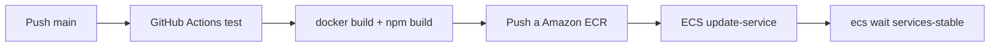

# Desplegament local i producció

## Prerequisits

### Backend

- PHP `>=8.2` amb extensions: `ctype`, `iconv`, `pdo_mysql`.
- Composer `>=2`.
- MySQL `8.0+`.
- Node.js `>=20` i npm (per als assets Twig amb Webpack Encore).
- Python `>=3.9` i pip (per a MkDocs, opcional).

### Frontend

- Node.js `>=20` i npm.

---

## Backend: instal·lació local des de zero

### 1. Clonar i instal·lar dependències

```bash
git clone <url-del-repo-backend>
cd backend-grup-6-gensync
composer install
```

### 2. Configurar variables d'entorn

```bash
cp .env .env.local
```

Edita `.env.local`:

```dotenv
APP_ENV=dev
APP_SECRET=genera-un-secret-aleatori-aqui
DATABASE_URL="mysql://root:@127.0.0.1:3306/db_hometab?serverVersion=8.0.43&charset=utf8mb4"
JWT_PASSPHRASE=la-teva-passphrase-local
MAILER_DSN="smtp://localhost:1025"
MAILER_FROM="hometab-local@example.com"
OPENROUTER_API_KEY=opcional-en-local
YOUTUBE_API_KEY=opcional-en-local
```

### 3. Generar claus JWT

```bash
php bin/console lexik:jwt:generate-keypair
```

Genera `config/jwt/private.pem` i `config/jwt/public.pem`. **No versionar**.

### 4. Crear la base de dades

```bash
php bin/console doctrine:database:create
php bin/console doctrine:migrations:migrate -n
```

### 5. Carregar fixtures (dades de prova)

```bash
php bin/console doctrine:fixtures:load -n
```

O amb la drecera:

```bash
composer db:reset
```

### 6. Compilar assets Twig (Webpack Encore)

```bash
npm install
npm run build
# En mode observació:
npm run watch
```

Swagger UI depen dels assets publics de `NelmioApiDocBundle`. Instal-la'ls despres de `composer install` si `/api/doc` es veu sense estils o en blanc:

```bash
php bin/console assets:install public --symlink --relative
```

### 7. Iniciar el servidor de desenvolupament

```bash
symfony server:start
# O amb el servidor incorporat de PHP:
php -S localhost:8000 -t public/
```

L'API estarà disponible a `http://localhost:8000/api`.
El backoffice Twig a `http://localhost:8000/admin`.
Swagger UI a `http://localhost:8000/api/doc`.

---

## Frontend: instal·lació local des de zero

### 1. Clonar i instal·lar dependències

```bash
git clone <url-del-repo-frontend>
cd frontend-grup-6-gensync
npm install
```

### 2. Configurar variables d'entorn (opcional)

Si el backend no corre a `localhost:8000`, crea un `.env.local`:

```dotenv
VITE_API_URL=http://localhost:8000/api
VITE_ASSET_URL=http://localhost:8000
```

### 3. Iniciar el servidor de desenvolupament

```bash
npm run dev
```

El frontend estarà disponible a `http://localhost:5173`.

---

## Backend: preparar entorn de test

```bash
# Crear BD de test i aplicar migracions
composer test:setup

# Executar tots els tests
composer test
```

La base de dades de test es configura a `.env.test`:

```dotenv
DATABASE_URL="mysql://root:@127.0.0.1:3306/db_hometab_test?serverVersion=8.0.43&charset=utf8mb4"
```

---

## MkDocs: generar la documentació

```bash
cd backend-grup-6-gensync
python -m pip install -r docs/mkdocs/requirements.txt
python -m mkdocs build -f docs/mkdocs/mkdocs.yml --strict
```

Accedeix a la documentació generada via el backend (requereix superadmin):

```
http://localhost:8000/admin/documentacio
```

---

## CORS: connexió frontend ↔ backend

Per defecte, el backend permet CORS des de `localhost` i `127.0.0.1`:

```dotenv
CORS_ALLOW_ORIGIN='^https?://(localhost|127\.0\.0\.1)(:[0-9]+)?$'
```

Si el frontend corre en un domini diferent, afegeix-lo a `.env.local`:

```dotenv
CORS_ALLOW_ORIGIN='^https://el-teu-domini\.com$'
```

---

## Desplegament a producció (AWS ECS)

El repositori inclou un workflow preparat per a desplegar a producció via AWS ECS al push a `main`. Aquest apartat documenta el que el workflow espera trobar; si els secrets AWS no estan configurats, aquest deploy no s'executara correctament.

### Components AWS

| Component | Servei AWS | Funció |
|---|---|---|
| Imatge Docker backend | Amazon ECR | Registre de contenidors |
| Servei backend | Amazon ECS | Execució del contenidor Symfony |
| Base de dades | Amazon RDS (MySQL 8) | Persistència de dades |
| Assets estàtics | Amazon S3 + CloudFront | Servir el frontend Vue compilat |
| Balanceador | Application Load Balancer | Distribució del trànsit |

### Flux de deploy producció



### Dockerfile del backend

```dockerfile
FROM php:8.3-fpm-alpine
# ... extensions, composer, etc.
COPY . /var/www/html
RUN composer install --no-dev --optimize-autoloader
```

---

## Desplegament al servidor DEV (EC2)

El workflow tambe contempla un deploy DEV per `rsync` sobre SSH, sense Docker. Depen dels secrets `DEV_*` del repositori:

```
EC2 (Apache + PHP-FPM) ← rsync ← GitHub Actions
```

El workflow configura el `.env.local` remotament des de secrets i executa:

```bash
composer install --no-interaction --prefer-dist --optimize-autoloader
php bin/console doctrine:migrations:migrate -n
php bin/console cache:clear --no-debug
php bin/console cache:warmup --no-debug
sudo systemctl reload apache2
```

---

## Troubleshooting

### Swagger no apareix a `/api/doc`

Comprova que el bundle i les rutes estan carregats:

```bash
composer show nelmio/api-doc-bundle
php bin/console debug:router | grep api/doc
```

En Windows:

```powershell
php bin/console debug:router | findstr api/doc
```

Si la ruta existeix pero la pantalla surt en blanc o sense estils, reinstal-la els assets publics de Symfony:

```bash
php bin/console assets:install public --symlink --relative
php bin/console cache:clear
```

Si el servidor Symfony estava encendido antes de cambiar de rama, reinicialo.

### Error: "Class 'PDO' not found" o "could not find driver"

```bash
# Verifica extensions PHP instal·lades
php -m | grep pdo
# Instal·la l'extensió si falta
sudo apt-get install php-mysql  # Ubuntu/Debian
```

### Error: JWT keypair no existeix

```bash
php bin/console lexik:jwt:generate-keypair
# Si peta per permisos:
mkdir -p config/jwt
chmod 700 config/jwt
```

### Error: "Access denied for user 'root'@'localhost'"

Comprova les credencials a `.env.local` i que MySQL estigui corrent:

```bash
mysql -u root -p
# Si no té contrasenya:
mysql -u root
```

### Error 500 al frontend (API no respon)

1. Comprova que el backend estigui corrent: `curl http://localhost:8000/api/login_check`.
2. Comprova CORS a la consola del navegador.
3. Comprova que `VITE_API_URL` apunta al backend correcte.

### MkDocs `--strict` falla per pàgines no trobades

Qualsevol pàgina referenciada al `mkdocs.yml` ha d'existir físicament. Comprova que tots els fitxers del `nav:` existeixin:

```bash
python -m mkdocs build -f docs/mkdocs/mkdocs.yml --strict 2>&1 | grep "WARNING"
```

### Cache Symfony no s'actualitza

```bash
php bin/console cache:clear
php bin/console cache:warmup
```

### Fixtures falla per clau duplicada

```bash
php bin/console doctrine:fixtures:load -n --purge-with-truncate
```

---

## Resum de ports locals per defecte

| Servei | Port | URL |
|---|---|---|
| Backend Symfony | 8000 | `http://localhost:8000` |
| API REST | 8000 | `http://localhost:8000/api` |
| Swagger UI | 8000 | `http://localhost:8000/api/doc` |
| Frontend Vue | 5173 | `http://localhost:5173` |
| MySQL | 3306 | `mysql://root:@localhost:3306` |
| MailHog (opcional) | 1025/8025 | `smtp://localhost:1025`, UI: `http://localhost:8025` |
