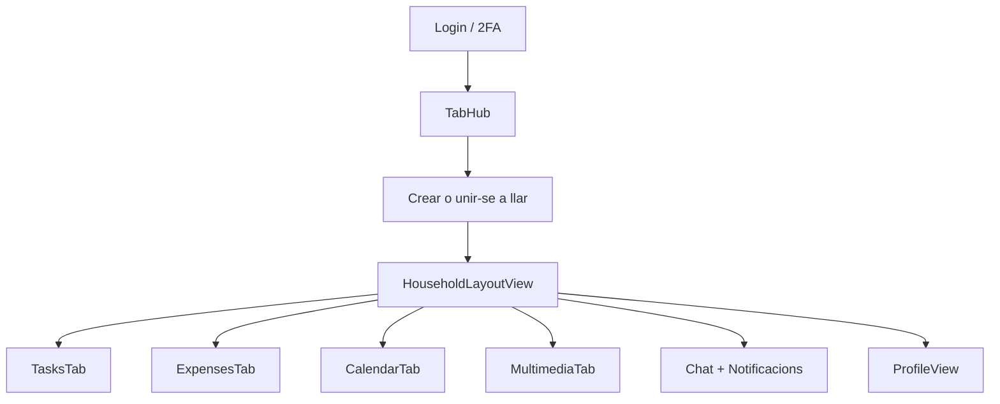
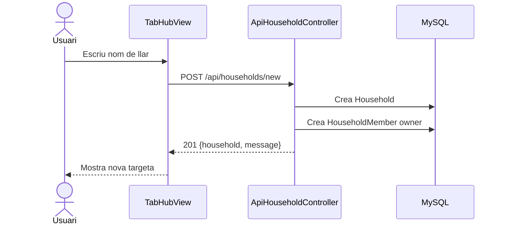
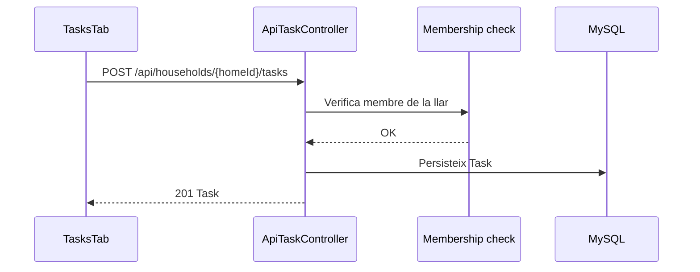
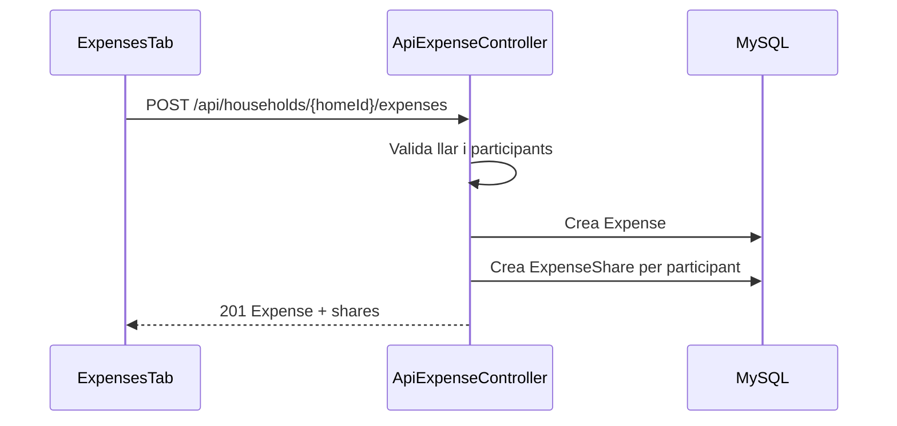
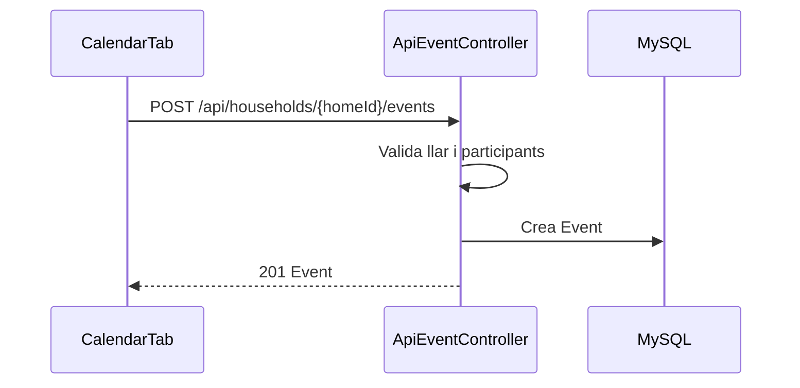

# Fluxos principals

Aquesta secció documenta els fluxos d'ús crítics de l'aplicació HomeTab, indicant quines vistes Vue intervenen, quins endpoints s'utilitzen, quines entitats es modifiquen i quins tests els cobreixen.

---

## Vista global de fluxos

## 1. Login normal

**Vista Vue**: `LoginView.vue`

**Flux**:

1. L'usuari escriu email i contrasenya i prem "Entrar".
2. `LoginView` fa `POST /api/login_check` amb `{ username, password }`.
3. El backend valida credencials a `AuthController::loginCheck()`.
4. Si la contrasenya és correcta i l'usuari és actiu:
   - Si `twoFactorEnabled = false` → retorna JWT directament.
   - Si `twoFactorEnabled = true` → retorna `{ requiresTwoFactor: true, challengeId }`.
5. El frontend desa `token` a `localStorage` i redirigeix a `/tabhub`.

**Endpoints**: `POST /api/login_check`

**Entitats llegides**: `User`

**Permisos**: públic (cap JWT requerit)

**Tests**:
- Backend: `AuthApiTest` — login correcte, credencials incorrectes, usuari inactiu.
- Frontend: `LoginView.test.js` — submit, error, redirecció si ja hi ha token.
- E2E: `critical-flows.spec.js` — login complet al navegador.

---

## 2. Login amb 2FA

**Vista Vue**: `LoginView.vue` (canvia d'step)

**Flux**:

1. Login inicial retorna `{ requiresTwoFactor: true, challengeId }`.
2. `LoginView` mostra el camp de codi (step 2).
3. L'usuari rep el codi per correu electrònic (generat per `TwoFactorService`, enviat per `TwoFactorEmailSender`).
4. L'usuari introdueix el codi i prem "Verificar".
5. El frontend fa `POST /api/login/verify` amb `{ challengeId, code }`.
6. El backend verifica el hash del codi a `TwoFactorCode`. Si és vàlid i no ha expirat, retorna JWT.
7. El frontend desa el token i redirigeix.

**Endpoints**:
- `POST /api/login_check` (step 1)
- `POST /api/login/verify` (step 2)

**Entitats modificades**: `TwoFactorCode` (marcada com a usada)

**Permisos**: públic

**Tests**:
- Backend: `AuthTwoFactorApiTest` — challengeId generat, codi invàlid retorna 400.
- Frontend: `LoginView.test.js` — vista mostra el camp de codi quan `requiresTwoFactor`.
- E2E: `critical-flows.spec.js` — gestiona el prompt 2FA si apareix.

---

## 3. Crear una llar

**Vista Vue**: `TabHubView.vue`

**Flux**:

1. L'usuari fa clic a "Crear nova llar" al TabHub.
2. Omple el nom (i opcionalment avatar o icona).
3. El frontend fa `POST /api/households/new` amb `{ name, avatarIcon?, avatarCropData? }`.
4. El backend (`ApiHouseholdController::new()`) crea la `Household` amb codi aleatori de 6 caràcters.
5. Crea una `HouseholdMember` amb rol `owner` per a l'usuari autenticat.
6. Retorna la llar creada amb `{ household: {...}, message: "..." }`.
7. El frontend afegeix la nova targeta al TabHub.

**Endpoints**: `POST /api/households/new`

**Entitats creades**: `Household`, `HouseholdMember`

**Permisos**: `ROLE_USER` (JWT requerit)

**Tests**:
- Backend: `HouseholdApiTest` — creació correcta, nom buit retorna 400.
- E2E: `critical-flows.spec.js` — crea llar via interfície.

---

## 4. Unir-se a una llar

**Vista Vue**: `TabHubView.vue`

**Flux**:

1. L'usuari fa clic a "Unir-se" i introdueix el codi de 6 caràcters.
2. El frontend fa `POST /api/households/join` amb `{ code }`.
3. El backend cerca la llar pel codi (`findOneBy(['inviteCode' => $code])`).
4. Comprova que l'usuari no sigui ja membre.
5. Crea una `HouseholdMember` amb rol `member`.
6. Retorna missatge d'èxit.
7. El frontend afegeix la llar a les targetes.

**Endpoints**: `POST /api/households/join`

**Entitats creades**: `HouseholdMember`

**Permisos**: `ROLE_USER`

**Tests**:
- Backend: `HouseholdApiTest` — unió correcta, codi invàlid 404, ja membre 409.

---

## 5. Crear una tasca

**Vista Vue**: `TasksTab.vue`

**Flux**:

1. L'usuari fa clic a "Nova tasca" dins la pestanya de tasques.
2. Omple el formulari: títol, descripció, data, prioritat, periodicitat, assignat.
3. El frontend fa `POST /api/households/{homeId}/tasks` amb el cos JSON.
4. El backend (`ApiTaskController::new()`) verifica que l'usuari és membre de la llar.
5. Crea la `Task` assignada a l'usuari indicat (o al creador per defecte).
6. Retorna la tasca creada.
7. El frontend afegeix la tasca a la llista.

**Endpoints**: `POST /api/households/{homeId}/tasks`

**Entitats creades**: `Task`

**Permisos**: `ROLE_USER` + membre de la llar

**Tests**:
- Backend: `HouseholdResourceApiTest` — tasca creada, títol buit 400, llar aliena 403.
- E2E: crea tasca per API autenticada, comprova renderitzat a la pestanya.

---

## 6. Crear una despesa

**Vista Vue**: `ExpensesTab.vue`

**Flux**:

1. L'usuari fa clic a "Nova despesa".
2. Omple: títol, import, categoria, tipus (individual/compartida), participants.
3. El frontend fa `POST /api/households/{homeId}/expenses`.
4. El backend (`ApiExpenseController::new()`) valida la pertinença a la llar de tots els participants.
5. Crea l'`Expense` i les `ExpenseShare` corresponents (una per participant, import dividit).
6. Retorna la despesa amb tots els `shares`.
7. El frontend actualitza la llista i el balance.

**Endpoints**: `POST /api/households/{homeId}/expenses`

**Entitats creades**: `Expense`, `ExpenseShare` (una per participant)

**Permisos**: `ROLE_USER` + membre de la llar

**Tests**:
- Backend: `HouseholdResourceApiTest` — despesa compartida, participant de llar aliena 400.

---

## 7. Crear un event

**Vista Vue**: `CalendarTab.vue`

**Flux**:

1. L'usuari fa clic a "Nou event" o en un dia del calendari.
2. Omple: títol, data inici, data fi, ubicació, color, participants.
3. El frontend fa `POST /api/households/{homeId}/events`.
4. El backend (`ApiEventController::new()`) verifica que els participants pertanyen a la llar.
5. Crea l'`Event` amb la llista de participants.
6. Retorna l'event creat.
7. El frontend situa l'event al calendari.

**Endpoints**: `POST /api/households/{homeId}/events`

**Entitats creades**: `Event` (amb relació ManyToMany a `User`)

**Permisos**: `ROLE_USER` + membre de la llar

**Tests**:
- Backend: `HouseholdResourceApiTest` — event creat, participant invàlid 400.

---

## 8. Usar el xat

**Vista Vue**: `HouseChatWidget.vue` (widget global)

**Flux**:

1. L'usuari fa clic a la icona de xat disponible a totes les pestanyes de la llar.
2. El widget es desplega (desktop: lateralment; mòbil: slide-up a pantalla completa).
3. El frontend fa `GET /api/households/{homeId}/chat/messages` per carregar els missatges.
4. L'usuari escriu un missatge i prem Enviar.
5. El frontend fa `POST /api/households/{homeId}/chat/messages` amb `{ content }`.
6. El backend (`ApiHouseholdChatController`) verifica que l'usuari és membre.
7. Crea el `HouseholdMessage` i el retorna.
8. El frontend afegeix el missatge al chat.

**Endpoints**:
- `GET /api/households/{id}/chat/messages`
- `POST /api/households/{id}/chat/messages`

**Entitats creades**: `HouseholdMessage`

**Permisos**: `ROLE_USER` + membre de la llar (comprovat per `HouseholdAccessService`)

**Tests**:
- Backend: `HouseholdChatApiTest` — llistar, crear, llar aliena 403, missatge buit 400.
- E2E: obre widget, envia missatge, comprova renderitzat.

---

## 9. Llegir notificacions

**Vista Vue**: `HouseNotificationsWidget.vue`

**Flux**:

1. L'usuari fa clic a la icona de campana.
2. El widget fa `GET /api/notifications`.
3. El backend (`ApiNotificationController::index()`) crida `NotificationService::syncForUser()`.
4. El `NotificationService` genera noves notificacions basades en tasques vencudes, despeses pendents i events pròxims.
5. Retorna la llista agrupada per llar amb `totalUnread` i `households[]`.
6. L'usuari fa clic a una notificació → `POST /api/notifications/{id}/read`.
7. O "Marcar totes com a llegides" → `POST /api/notifications/read-all`.

**Endpoints**:
- `GET /api/notifications`
- `POST /api/notifications/{id}/read`
- `POST /api/notifications/read-all`

**Entitats modificades**: `Notification` (camp `isRead`)

**Permisos**: `ROLE_USER` (cada usuari veu les seves pròpies notificacions)

**Tests**:
- Backend: `NotificationApiTest` — agrupació, marcar una, marcar totes, bloqueig alienes.
- Frontend: `useNotifications.test.js` — fetch, mark read, polling, comptador.

---

## 10. Crear una playlist multimèdia

**Vista Vue**: `MultimediaTab.vue`

**Flux**:

1. L'usuari va a la pestanya "Multimèdia".
2. Fa clic a "Nova playlist" i posa un nom.
3. El frontend fa `POST /api/households/{homeId}/multimedia/playlists` amb `{ name }`.
4. El backend crea la `MultimediaPlaylist` associada a la llar i creada per l'usuari.
5. L'usuari fa clic a "Afegir vídeo", cerca per paraula clau o URL.
6. El frontend fa `GET /api/households/{homeId}/multimedia/search?q=query` (YouTube).
7. L'usuari selecciona un vídeo i el frontend fa `POST .../playlists/{id}/videos` amb les metadades.
8. El backend crea el `MultimediaVideo` amb el `youtubeId` i la posició.

**Endpoints**:
- `GET /api/households/{homeId}/multimedia/playlists`
- `POST /api/households/{homeId}/multimedia/playlists`
- `GET /api/households/{homeId}/multimedia/search?q=...`
- `POST /api/households/{homeId}/multimedia/playlists/{id}/videos`

**Entitats creades**: `MultimediaPlaylist`, `MultimediaVideo`

**Permisos**: `ROLE_USER` + membre de la llar

**Tests**:
- Backend: `MultimediaApiTest` — llista, creació, llar aliena 403, nom buit 400, vídeo afegit.
- Frontend: `MultimediaTab.test.js` — càrrega playlists, creació, afegir vídeo, error.
- E2E: crea playlist i comprova renderitzat. Afegir vídeo queda cobert per test unitari/frontend i funcional/backend.

---

## 11. Editar el perfil

**Vista Vue**: `ProfileView.vue`

**Flux**:

1. L'usuari va a `/profile`.
2. El frontend fa `GET /api/profile` per carregar les dades actuals.
3. L'usuari modifica camps (nom, correu, telèfon, bio, avatar).
4. El frontend fa `POST /api/profile` amb els camps modificats.
5. El backend (`ApiProfileController::updateProfile()`) valida el nou email (que no estigui en ús), processa la imatge si n'hi ha, i actualitza l'`User`.
6. Retorna les dades actualitzades.

**Endpoints**:
- `GET /api/profile`
- `POST /api/profile`

**Entitats modificades**: `User`

**Permisos**: `ROLE_USER` (cada usuari edita el seu propi perfil)

**Tests**:
- Backend: `ProfileApiTest` — lectura, actualització, email duplicat, contrasenya incorrecta.
- Frontend: `ProfileView.test.js` — càrrega, validació avatar, guardat, errors API.

---

## 12. Accedir al backoffice (admin)

**Vista**: Twig (no Vue)

**Flux**:

1. El superadmin va a `/login` al backend desplegat.
2. Introdueix credencials amb rol `ROLE_SUPER_ADMIN`.
3. `SecurityController` i `LoginFormAuthenticator` autentiquen via formulari (sessió PHP).
4. Symfony crea la sessió al firewall `main`.
5. El superadmin accedeix a `/admin` — `AdminController` renderitza el panell.
6. Des d'aquí pot gestionar: llars, usuaris (activar/desactivar), tasques, despeses, events, xats, SQL i documentació.

**Permisos**: `ROLE_SUPER_ADMIN` obligatori per a totes les rutes `/admin/*`

**Especial**:
- Accés als xats deixa rastre a `ChatAccessLog` (admin + llar + motiu + data).
- La documentació MkDocs es serveix via `AdminDocumentationController` que verifica `ROLE_SUPER_ADMIN` i que el path no surti del directori `site/`.
