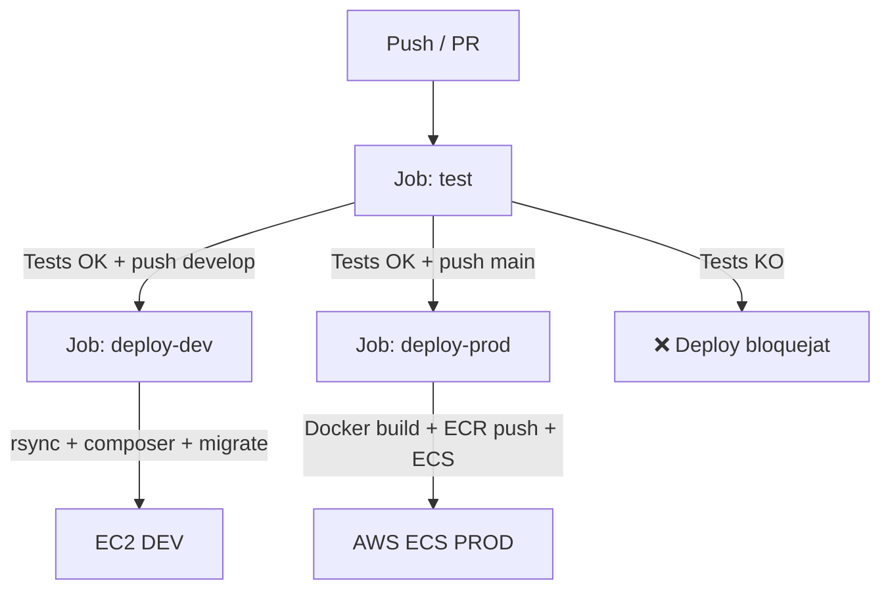

# Integració contínua (CI/CD)

## Visió general

HomeTab utilitza **GitHub Actions** per automatitzar les proves i el desplegament. El workflow principal viu a:

```
backend-grup-6-gensync/.github/workflows/deploy-backend.yml
```

---

## Disparadors del workflow

```yaml
on:
  push:
    branches: [develop, main]
  pull_request:
    branches: [develop, main]
  workflow_dispatch:    # Execució manual
    inputs:
      target:
        type: choice
        options: [dev, prod]
```

- **`push develop`** → tests + deploy DEV.
- **`push main`** → tests + deploy PROD (AWS).
- **`pull_request`** → tests (sense deploy).
- **Manual** → es pot triar entorn.

---

## Job 1: `test`

Executa les proves de qualitat del backend. **Bloqueja el deploy si fallen**.

### Servei MySQL

El job aixeca un contenidor MySQL 8.0 a GitHub Actions:

```yaml
services:
  mysql:
    image: mysql:8.0
    env:
      MYSQL_ALLOW_EMPTY_PASSWORD: yes
      MYSQL_DATABASE: db_hometab_test
    options: --health-cmd="mysqladmin ping -h 127.0.0.1 -uroot" ...
```

### Passos

| Pas | Acció |
|---|---|
| Checkout | `actions/checkout@v4` |
| Setup PHP 8.3 | `shivammathur/setup-php@v2` amb `ctype, iconv, pdo_mysql`, xdebug |
| Setup Node.js 20 | `actions/setup-node@v4` |
| Install PHP deps | `composer install --no-interaction --prefer-dist` |
| Generar claus JWT | `lexik:jwt:generate-keypair --skip-if-exists --env=test` |
| Preparar BD test | `composer test:setup` (crea BD + migracions en entorn test) |
| **Tests backend** | `composer test` → `php bin/phpunit` |
| Build assets Twig | `npm ci && npm run build` |

### Variables d'entorn del job `test`

```yaml
APP_ENV: test
DATABASE_URL: mysql://root:@127.0.0.1:3306/db_hometab_test?serverVersion=8.0.43&charset=utf8mb4
JWT_SECRET_KEY: '%kernel.project_dir%/config/jwt/private.pem'
JWT_PUBLIC_KEY: '%kernel.project_dir%/config/jwt/public.pem'
JWT_PASSPHRASE: change-me-in-env-local
CORS_ALLOW_ORIGIN: '^https?://(localhost|127\.0\.0\.1)(:[0-9]+)?$'
MAILER_DSN: null://null
MAILER_FROM: hometab-test@example.test
```

!!! note "Base de dades aillada"
    El servei MySQL del workflow crea `db_hometab_test` i el job apunta a aquesta mateixa base. Això evita tocar dades locals, DEV o producció quan s'executa PHPUnit en CI.

---

## Job 2: `deploy-dev`

S'executa **només si `test` ha passat** i el push és a `develop` (o manual a `dev`).

### Passos

1. **Validació** de `composer.json`.
2. **Build assets Twig** (`npm ci && npm run build`).
3. **Permisos SSH** al servidor DEV (EC2): crea directoris, ajusta `chown` i `chmod`.
4. **Sincronització rsync** del codi al servidor (exclou `.git`, `vendor`, `node_modules`, `.env.local`, claus JWT).
5. **Configuració remota** al servidor DEV:
   - Reconstrueix `.env.local` des de secrets.
   - Decodifica claus JWT des de base64.
   - Executa `composer install --optimize-autoloader`.
   - Executa migracions (`doctrine:migrations:migrate`).
   - Neteja i escalfa la caché.
   - Ajusta permisos de `var/` i `config/jwt/`.
   - `systemctl reload apache2`.

---

## Job 3: `deploy-prod`

S'executa **només si `test` ha passat** i el push és a `main` (o manual a `prod`).

Esta preparado para utilizar **AWS ECS** con contenedores Docker cuando existan los secrets AWS requeridos:

### Passos

1. **Configura credencials AWS** (`aws-actions/configure-aws-credentials@v4`).
2. **Login a Amazon ECR**.
3. **Build assets Twig** (`npm ci && npm run build`).
4. **Build i push de la imatge Docker**:
   ```bash
   docker build -t "$IMAGE_URI:$GITHUB_SHA" -t "$IMAGE_URI:latest" .
   docker push "$IMAGE_URI:$GITHUB_SHA"
   docker push "$IMAGE_URI:latest"
   ```
5. **Redeploy del servei ECS**:
   ```bash
   aws ecs update-service --cluster $ECS_CLUSTER --service $ECS_BACKEND_SERVICE --force-new-deployment
   aws ecs wait services-stable ...
   ```

---

## Diagrama de flux CI/CD



---

## Tests E2E en CI

Si els secrets `E2E_EMAIL`, `E2E_PASSWORD` i `E2E_API_URL` estan configurats al repositori, Playwright pot executar els smoke tests contra l'entorn DEV real après d'un deploy exitós:

```yaml
- name: Run E2E tests (smoke)
  if: env.E2E_EMAIL != ''
  env:
    E2E_EMAIL: ${{ secrets.E2E_EMAIL }}
    E2E_PASSWORD: ${{ secrets.E2E_PASSWORD }}
    E2E_API_URL: ${{ secrets.E2E_API_URL }}
    E2E_BASE_URL: ${{ secrets.E2E_BASE_URL }}
  run: |
    cd Frontend/frontend-grup-6-gensync
    npm ci
    npx playwright install chromium
    npm run test:e2e
```

---

## Executar localment (equivalent al CI)

### Backend

```powershell
cd Backend\backend-grup-6-gensync

# 1. Instal·lar dependències
composer install

# 2. Generar claus JWT (si no existeixen)
php bin/console lexik:jwt:generate-keypair --skip-if-exists

# 3. Preparar BD de test
composer test:setup

# 4. Executar tots els tests
composer test

# 5. Executar per suites
composer test:unit
composer test:functional
```

### Frontend

```powershell
cd Frontend\frontend-grup-6-gensync

# Tests unitaris
npm run test:unit

# Coverage
npm run test:coverage

# Build de producció
npm run build

# E2E (requereix servidor i variables d'entorn)
$env:E2E_EMAIL = "usuari-e2e@example.com"
$env:E2E_PASSWORD = "password-de-proves"
$env:E2E_BASE_URL = "http://127.0.0.1:5173"
$env:E2E_API_URL = "http://127.0.0.1:8000/api"
$env:E2E_SKIP_WEBSERVER = "1"
npm run test:e2e
```

### MkDocs

```powershell
cd Backend\backend-grup-6-gensync

# Instal·lar dependències Python
python -m pip install -r docs/mkdocs/requirements.txt

# Build amb validació estricta
python -m mkdocs build -f docs/mkdocs/mkdocs.yml --strict
```
